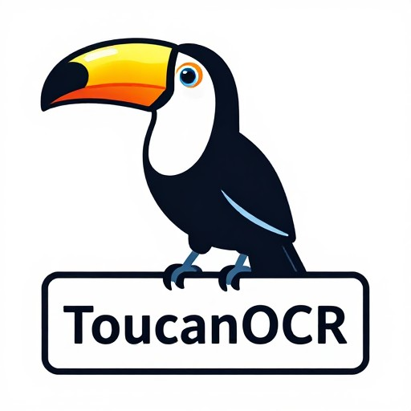

# ToucanOCR v1.1.0

ToucanOCR是基于GLM-OCR API的开源图片和PDF转Markdown工具，具有图形用户界面，并附带Markdown翻译功能。

## 功能特点

- 软件所依赖的GLM-OCR是排名前列的专业OCR模型，在复杂场景中表现稳定且精度领先
- 某些所谓的免费转换工具对pdf文件大小有限制，本软件对pdf文件大小没有任何限制
- 翻译功能使用GLM-4-Flashx-250414模型，最高支持100线程，翻译一个由1000页pdf转化而来的md文件仅需3分钟
- 价格低廉，GLM-OCR API仅需0.2元/百万Tokens，1元即可处理约2000张A4大小扫描图片。GLM-4-Flashx-250414 API仅需0.1元/百万Tokens，1元约能处理300万单词


## 使用方法

### 快速使用：

- 直接下载预编译好的软件压缩包，解压后运行

### python环境下运行：

1. 下载并安装Python 3.8或更高版本
2. 在软件根目录下启动命令行，输入以下命令：
   
     ```

     #创建虚拟环境
     python -m venv .venv 

     #激活虚拟环境
     source .venv/bin/activate 

     #安装依赖
     pip install zai-sdk pypdf requests

     #启动软件
     python main.py 

     ```
### 注册并获取GLM-OCR API密钥：

   - 访问[GLM-OCR官网](https://bigmodel.cn)
   - 注册并登录账号
   - 在 API Keys 管理页面创建 API Key
   - 复制您的 API Key 以供使用

## 注意事项

- 本软件免费，但依赖的GLM API密钥是收费的，请周知
- GLM-OCR限制图片大小低于10MB，超过10MB的图片请先压缩至10MB以下
- GLM-OCR限制并发数1，请不要多开
- 修改config.json中的提示词可以实现自定义翻译，修改前记得备份


## v1.0.1改进：
1. 增加翻译功能
2. 增加token使用统计

## 许可证

本项目采用 MIT 许可证 - 详见下文

Copyright (c) 2023 ToucanOCR

Permission is hereby granted, free of charge, to any person obtaining a copy
of this software and associated documentation files (the "Software"), to deal
in the Software without restriction, including without limitation the rights
to use, copy, modify, merge, publish, distribute, sublicense, and/or sell
copies of the Software, and to permit persons to whom the Software is
furnished to do so, subject to the following conditions:

The above copyright notice and this permission notice shall be included in all
copies or substantial portions of the Software.

THE SOFTWARE IS PROVIDED "AS IS", WITHOUT WARRANTY OF ANY KIND, EXPRESS OR
IMPLIED, INCLUDING BUT NOT LIMITED TO THE WARRANTIES OF MERCHANTABILITY,
FITNESS FOR A PARTICULAR PURPOSE AND NONINFRINGEMENT. IN NO EVENT SHALL THE
AUTHORS OR COPYRIGHT HOLDERS BE LIABLE FOR ANY CLAIM, DAMAGES OR OTHER
LIABILITY, WHETHER IN AN ACTION OF CONTRACT, TORT OR OTHERWISE, ARISING FROM,
OUT OF OR IN CONNECTION WITH THE SOFTWARE OR THE USE OR OTHER DEALINGS IN THE
SOFTWARE.

